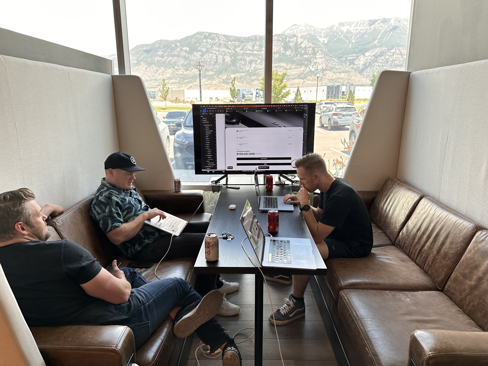

Spent an hour today just staring at a blank canvas instead of building. Not sure if that's procrastination or actually part of the process.

> "The impediment to action advances action. What stands in the way becomes the way."
> — Marcus Aurelius

Some things I keep coming back to:

- Constraints make decisions easier, not harder
- Most "creative block" is actually a decision-fatigue problem
- The blank page is never actually blank — it's full of assumptions

Anyway. Back to it.